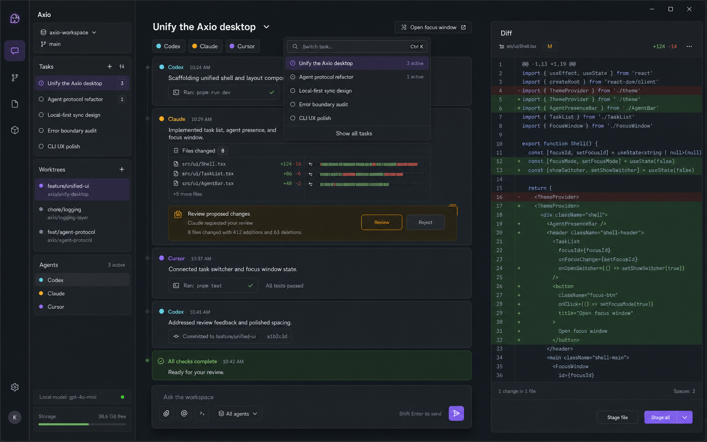
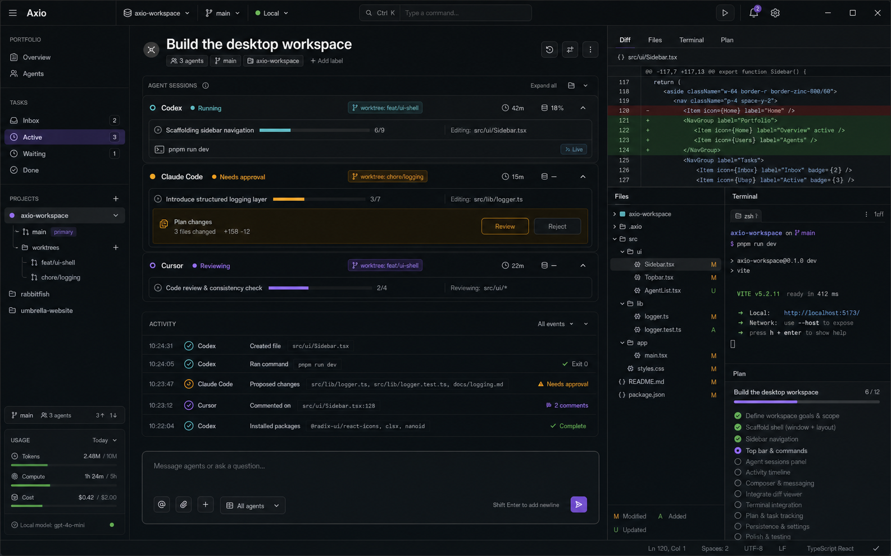

# Desktop design

Axio is one adaptive desktop workspace for running, steering, and reviewing
coding agents. The old idea of a separate switcher is absorbed into task
switching, the command palette, and focus mode.

## Information architecture

- **Portfolio zoom:** projects, tasks, worktrees, agent health, and usage.
- **Task zoom:** one chronological narrative containing every agent event,
  question, approval, command, and file change.
- **Focus zoom:** the same task canvas with navigation and context tools hidden.
- **Context dock:** browser, files, changed-file review, completed command
  output, and a read-only plan for the selected task.

The central timeline is the source of narrative truth. Agent cards are useful
for portfolio monitoring, but they do not become separate chat silos inside a
task. Approval requests appear inline at the point that produced them.

## Interaction contract

- `Ctrl+K` switches tasks and runs workspace commands.
- `Ctrl+Shift+F` toggles focus mode.
- Drag any non-interactive titlebar area to move the window; hold `Alt` to drag
  from any non-interactive surface.
- The titlebar workspace and context buttons independently reveal their side
  panels on wide windows. At 720px and below, only one overlay can be open.
- At wide sizes, both panels resize by pointer or keyboard and preserve their
  bounded widths across restarts.
- One centered toolbar above the task exposes Focus and every context tool even
  while the dock is closed. The dock repeats icon navigation at its top so
  overlayed tools remain switchable.
- Workspace settings can make the task toolbar icon-only, hide its Review count,
  and choose the dock's initial tool without removing accessible names or
  attention state.
- Compact overlays use a scrim, contain keyboard focus, close with Escape, and
  restore focus to the control that opened them.
- Agent presence chips open the Agents panel; only explicitly labelled
  Pause/Resume controls change demo lifecycle state.
- Review status appears in the task and timeline, while Return with feedback
  and Approve review exist only in the Review tool.
- The composer shows target, worktree, direction mode, and review policy before
  sending, and its action label follows the selected target.
- Empty task submission remains in the dialog with linked inline guidance.
- Focus mode has one Exit focus mode control and restores the previous panel
  layout when it ends.

## Visual direction

The task-first concept is the default desktop direction:

The denser control-room concept informs portfolio zoom:

Both concepts were generated from the same product constraints. They are
directional references; production UI remains code-native and accessible.

## Implemented visual system

The production shell uses restrained glass rather than stacking opaque cards:
translucent surfaces, fine borders, soft violet and cyan ambient light, and
motion that communicates state changes. The central timeline stays visually
quiet so approvals, failures, and review actions carry the emphasis.

Workspace navigation lives in one collapsible, resizable left panel. Browser,
Files, Review, Output, and Plan share a resizable right dock. A centered
workspace toolbar and the dock's centered top navigation use Fluent SVG icons
instead of platform font glyphs. Both side panels become overlays on compact
windows. Animation respects
`prefers-reduced-motion`, controls retain visible focus states, and glass
surfaces keep an opaque-enough fallback for readability.

Implementation screenshots and the responsive comparison record live in
[`design/`](design/), with the latest verification summarized in
[`../design-qa.md`](../design-qa.md).
The complete preference contract is in [`settings.md`](settings.md).

Controls that currently mutate demo state rather than real agent, terminal, or
Git resources are identified in
[`status-and-direction.md`](status-and-direction.md).

The audited hierarchy, attention, composer, context, responsive, and keyboard
pass is implemented. Its evidence and remaining refinements are tracked in
[`ui-improvement-plan.md`](ui-improvement-plan.md),
[`ui-audit-2026-07-22.md`](ui-audit-2026-07-22.md), and
[`../design-qa.md`](../design-qa.md).
